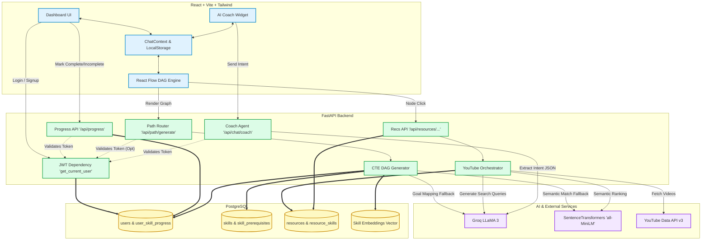

# SkillRoute

SkillRoute is an intelligent, personalized learning platform that dynamically maps out optimal educational journeys based on a user's skills, budget, and learning preferences. 

The platform acts as a GPS for education, moving away from static lists of courses and instead providing a highly interactive, node-based Directed Acyclic Graph (DAG) that visualizes prerequisites, core concepts, and recommended resources to reach a specific career destination.

## System Architecture

The application is built on a modern decoupled architecture:

### Frontend (Client)
- **Framework:** React + TypeScript (Vite)
- **State Management:** React Context API (`ChatContext`)
- **Styling:** Tailwind CSS (Premium light theme, custom components)
- **Core Visualization:** React Flow (`@xyflow/react`) for rendering the interactive DAG Learning Map
- **Icons:** Lucide React

### Backend (Server)
- **Framework:** FastAPI (Python)
- **Database:** PostgreSQL
- **ORM & Migrations:** SQLAlchemy and Alembic
- **Auth:** JWT (PyJWT) with bcrypt hashing
- **Concurrency:** Async/Await handling via `aiohttp` for robust data pipelines

### AI & Core Services
- **LLM:** Groq API (LLaMA 3 8B) via `langchain_groq`
- **Embeddings:** `SentenceTransformers` (`all-MiniLM-L6-v2`) for semantic matching
- **External APIs:** YouTube Data API v3

### Architecture Flow Diagram



### Ingestion Pipeline
A production-grade, highly scalable asynchronous data pipeline designed to ingest and normalize external course datasets (like Coursera or Udemy):
- **Idempotency:** Safely re-runs datasets without creating duplicates, only applying genuine changes.
- **Concurrent Validation:** Automatically pings URLs during ingestion to detect dead links (404s) without hammering external servers.
- **Skill Mapping:** Translates arbitrary provider tags into SkillRoute's controlled vocabulary.

## Core Features

- **AI Chat Profiler:** An intelligent onboarding flow where users discuss their goals with an AI coach. The system extracts their intent, performs a gap analysis, and sequences a DAG learning route.
- **Interactive Learning Map:** A dynamic, 3-column dashboard where users can explore their custom roadmap. Users can zoom, pan, and click on nodes to reveal deep resource details.
- **Dynamic Node States:** Visual indicators for progress including "Completed", "In Progress", "Locked", and "Destination Target".
- **Real-time AI Overlay:** A floating chatbot widget that persists state across the application, allowing users to tweak their map on the fly.
- **Robust Resource Catalogue:** A verified, deduplicated backend database containing normalized cost, difficulty, and URL metadata.

## Detailed Workflow

Understanding how SkillRoute transforms a user's initial prompt into a highly personalized, dynamic learning map:

### 1. AI Onboarding & Intent Extraction
- **The Chat Profiler**: When a user registers, they are greeted by an AI coach (powered by Langchain and Groq). The user casually describes what they want to learn, their background, timeline, and budget constraints.
- **Context Generation**: Instead of rigid forms, the Groq LLM parses this conversation to extract a structured JSON `Profile` containing their `target_goal`, `current_skills`, `time_commitment`, and `budget`. 
- **State Persistence**: This multi-turn chat history and the extracted profile are saved in the frontend's `localStorage` (via React Context), ensuring the user never loses their progress if they refresh or navigate away.

### 2. DAG Generation (The Learning Map)
- **Database Search**: The extracted `target_goal` (e.g., "Generative AI") is sent to the FastAPI backend (`/api/path/generate`).
- **Recursive Tree Building**: The PostgreSQL database utilizes a recursive Common Table Expression (CTE) query to scan the `skill_prerequisites` table. It recursively climbs the prerequisite tree from the target goal down to the foundational skills.
- **Gap Analysis**: The backend cross-references this complete tree with the user's `current_skills`. It then assigns states to each node:
  - `completed`: The user already knows this.
  - `current`/`next`: The immediate next steps where all prerequisites are met.
  - `locked`: Advanced skills blocked by unlearned prerequisites.
  - `goal`: The final destination.
- **Centered Tree Algorithm**: The backend calculates precise `x` and `y` coordinates for each node to ensure the ReactFlow graph renders symmetrically and beautifully on the dashboard.

### 3. Dynamic Dashboard Rendering
- **Route Planner (Left Sidebar)**: The frontend dynamically calculates the minimum number of stops required to reach the goal. It offers three personalized routes: *Fast Track*, *Balanced*, and *Deep Dive*, recalculating estimated times based on the graph's complexity.
- **Readiness Radar (Right Sidebar)**: Rather than showing hardcoded metrics, the dashboard calculates the user's "Overall Readiness" by dividing their completed nodes by the total required nodes. It dynamically tracks milestones and estimates total hours invested.

### 4. Real-time YouTube Resource Discovery
- **Node Interaction**: When the user clicks an active node on the map, the frontend fires a request to the `/api/resources/youtube/discover` endpoint.
- **Intent-based Search**: The backend `YouTubeDiscoveryOrchestrator` uses Groq to generate 3 highly optimized YouTube search queries tailored specifically to the user's `learner_level` and the target skill.
- **Live Fetch & Cache**: It hits the live YouTube Data API. To ensure performance and save quotas, it aggressively deduplicates results and checks its local PostgreSQL cache before making external calls.
- **Semantic Ranking & Verification**: The returned videos are semantically scored against the skill intent using a semantic matcher, and their URLs are asynchronously pinged to verify they aren't dead links.
- **Delivery**: The verified, ranked videos are delivered back to the frontend, rendering as actionable "Watch Now" cards in the side panel, perfectly matched to the user's current learning node!

### 5. Phase 1.9 Upgrades: Agentic Coach & Paid Discovery
- **Authentic Authentication**: Integrated robust JWT authentication across all mutable endpoints to guarantee user progress is safely stored and isolated.
- **Persistent Progress API**: Centralized progress tracking in a PostgreSQL `UserSkillProgress` model, allowing users to safely log out and resume without relying solely on local storage.
- **AI Coach Intent Engine**: The floating AI Coach now uses an active Langchain/Groq intent extractor. Telling the bot "I already know Docker" translates into a strict backend `MARK_SKILL_COMPLETED` JSON action, syncing the DB and seamlessly triggering a frontend graph re-render.
- **Dynamic Goal Fallback**: Advanced path generation routing first checks for exact and alias matches, then falls back to `SentenceTransformer` semantic embedding similarities, and only finally uses a highly constrained Groq prompt to decompose niche goals into verified DB concepts to prevent hallucinations.
- **Paid Course PostgreSQL Discovery**: The recommendation engine now dynamically reads the user's budget state (FREE vs PAID) and queries internal PostgreSQL Coursera and Udemy resource ingestion tables, filtering and rendering full course previews natively inside the map's right sidebar.
- **Map History Navigation**: An interactive Local map history stack maintaining up to 20 past graph states, letting users non-destructively `←` / `→` undo or redo layout changes triggered by chat.

## Local Setup & Installation

### Prerequisites
- Node.js (v18+)
- Python (3.10+)
- PostgreSQL

### 1. Database Setup
1. Ensure PostgreSQL is running locally.
2. Create a database named `aln_db` (or update the connection string in `backend/database.py`).

### 2. Backend Setup
Navigate to the backend directory and set up the Python environment:
```bash
cd backend
python -m venv venv

# On Windows:
venv\Scripts\activate
# On Mac/Linux:
source venv/bin/activate

# Install dependencies
pip install -r requirements.txt

# Run database migrations
alembic upgrade head

# Start the FastAPI server
uvicorn main:app --reload
```
The backend API will be available at `http://localhost:8000`.

### 3. Frontend Setup
Open a new terminal, navigate to the frontend directory, and start the development server:
```bash
cd frontend
npm install
npm run dev
```
The application UI will be available at `http://localhost:5173`.

### 4. Running the Ingestion Pipeline (Optional)
To seed the database with external course data:
```bash
cd backend
# Make sure your venv is activated
python scripts/import_resources.py --source coursera --file data/raw/coursera.csv
```
Use the `--dry-run` flag to validate a dataset without mutating the database.
